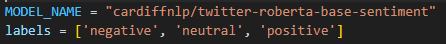
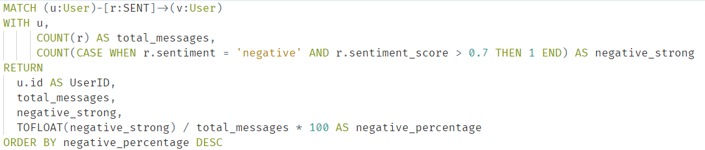

# RoBERTa-based Graph Anomaly Detection (RGAD)

## Problem Statement 
&nbsp;&nbsp;&nbsp;&nbsp;&nbsp;&nbsp;&nbsp;&nbsp;&nbsp;&nbsp;"𝐀𝐫𝐨𝐮𝐧𝐝 𝟏𝟓% 𝐨𝐟 𝐚𝐝𝐨𝐥𝐞𝐬𝐜𝐞𝐧𝐭𝐬 𝐡𝐚𝐯𝐞 𝐛𝐞𝐞𝐧 𝐯𝐢𝐜𝐭𝐢𝐦𝐬 𝐨𝐟 𝐜𝐲𝐛𝐞𝐫𝐛𝐮𝐥𝐥𝐲𝐢𝐧𝐠", according to a survey conducted by the WHO between 2018 and 2022. This highlights the urgent need to find solutions to identify online harassers and sanction them. Traditional methods for detecting malicious behaviors are often ineffective in the context of social networks due to the complexity and diversity of social interactions. Classical relational databases fail to capture the dynamic and heterogeneous nature of social relationships. Moreover, many detection systems lack semantic and relational context, which hinders the early identification of risky behavior.

## Proposed Solutions 💡

&nbsp;&nbsp;&nbsp;&nbsp;&nbsp;&nbsp;&nbsp;&nbsp;&nbsp;&nbsp;This project aims to design a detection engine based on a graph-oriented NoSQL database (Neo4j) a graph-based database, commonly used in Social Networks to store data. After weeks of research and documentation, we implemented two algorithms:

1️⃣ 𝐑𝐨𝐁𝐄𝐑𝐓𝐚-𝐛𝐚𝐬𝐞𝐝 𝐆𝐫𝐚𝐩𝐡 𝐀𝐧𝐨𝐦𝐚𝐥𝐲 𝐃𝐞𝐭𝐞𝐜𝐭𝐢𝐨𝐧 (𝐑𝐆𝐀𝐃): In this approach, each message in the database is labeled using the pre-trained Twitter-RoBERTa-base-sentiment model (Cardiff NLP). Then, we calculate the percentage of strongly negative messages per user.

2️⃣𝐆𝐫𝐚𝐩𝐡-𝐁𝐚𝐬𝐞𝐝 𝐁𝐞𝐡𝐚𝐯𝐢𝐨𝐫𝐚𝐥 𝐀𝐧𝐨𝐦𝐚𝐥𝐲 𝐃𝐞𝐭𝐞𝐜𝐭𝐢𝐨𝐧 (𝐆𝐁𝐁𝐀𝐃): This method is built on a pipeline composed of several stages, including basic graph metrics analysis, centrality computation, temporal behavior profiling, and detection of outliers through message flow and directionality.

## Dataset 📊

&nbsp;&nbsp;&nbsp;&nbsp;&nbsp;&nbsp;&nbsp;&nbsp;&nbsp;&nbsp;The dataset used comes from a [Scopus](https://www.scopus.com/home.uri), which consists of: profiles of teenagers, messages
(normal or aggressive), and social relationships. The provided CSV files are:

* users_data.csv: user identities with sociodemographic attributes.
* communication_data.csv: interactions (messages, labels).

These data have been cleaned and reduced to avoid imbalances (for example, by randomly
removing 50% of normal and aggressive messages).

## RGAD Implementation

&nbsp;&nbsp;&nbsp;&nbsp;&nbsp;&nbsp;&nbsp;&nbsp;&nbsp;&nbsp;We developed a behavioral anomaly detection pipeline based on sentiment analysis of messages exchanged within a Neo4j graph database. The pipeline consists of two main stages:

* **Labeling**: The first step of the pipeline involves performing sentiment analysis on
messages exchanged between users in a Neo4j graph database. Each message is
processed using the pre-trained Twitter-RoBERTa-base-sentiment model developed
by Cardiff NLP. This model, which is specialized in analyzing social media text,
assigns a sentiment label to each message from among three categories: positive,
neutral, or negative. In addition to the label, the model provides a confidence score
that reflects how certain it is about its prediction. This step enriches the graph
relationships with emotional information derived from the textual content.

* **Percentage computation**: Once all the messages are labeled, the second step
consists of analyzing user behavior by computing, for each user, the percentage of
negative messages with a confidence score higher than 70%, relative to the total
number of messages they have sent. This confidence threshold is used to focus only
on messages that the model considers strongly negative. The resulting percentage
serves as an indicator for identifying potentially toxic or abnormal behavior. A
user who sends a high proportion of strongly negative messages may be flagged for
further analysis to detect possible malicious intent or harassment situations.

